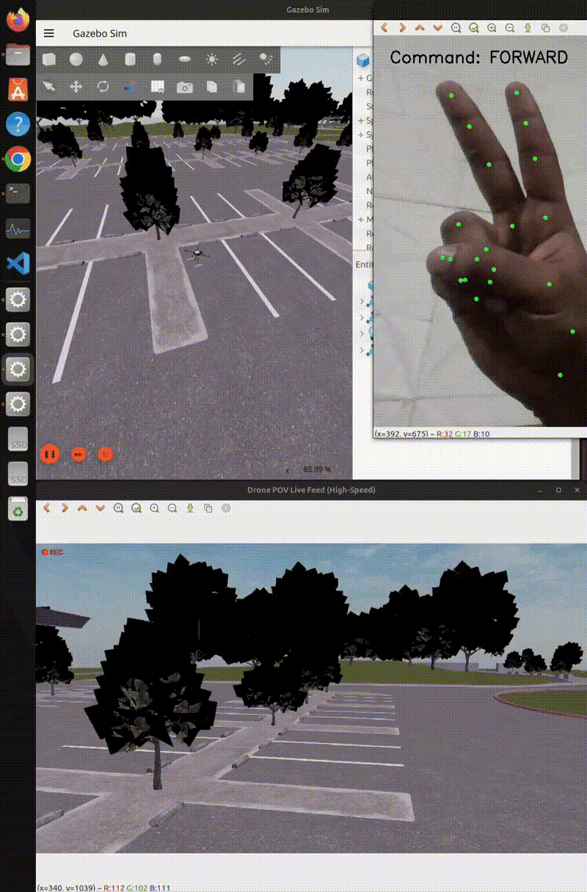

# Gesture-Controlled PX4 Drone 🚁🖐️

A computer-vision-based drone control system that uses **hand gestures to control a PX4 drone in Gazebo simulation**.

The project combines **MediaPipe, OpenCV, ROS 2 Jazzy, PX4 Autopilot, Gazebo Harmonic, and Micro XRCE-DDS** to create a real-time gesture-driven UAV control pipeline.

> **Current status:** Working simulation with real-time hand gesture control and PX4 Offboard flight control.

---

## 🎥 Demo

A short demonstration of the drone being controlled using hand gestures:


<p align="center">
  
</p>
watch full video: [Gesture-Controlled PX4 Drone Demo](https://lnkd.in/p/dMXvTdqU)

**Hand Gesture → Computer Vision → ROS 2 → PX4 → Drone**

The system recognizes gestures from a camera and converts them into flight commands that are sent to the simulated PX4 drone.

---

## 🧠 System Architecture

```text
             ┌─────────────────────┐
             │      Webcam         │
             └──────────┬──────────┘
                        │
                        ▼
             ┌─────────────────────┐
             │ MediaPipe + OpenCV  │
             │  Hand Gesture       │
             │    Detection        │
             └──────────┬──────────┘
                        │
                  Gesture Command
                        │
                        ▼
             ┌─────────────────────┐
             │      ROS 2 Jazzy    │
             │   Gesture / Control │
             │        Nodes        │
             └──────────┬──────────┘
                        │
                  PX4 Messages
                        │
                        ▼
             ┌─────────────────────┐
             │ Micro XRCE-DDS      │
             │       Agent         │
             └──────────┬──────────┘
                        │
                        ▼
             ┌─────────────────────┐
             │    PX4 Autopilot    │
             │    Offboard Mode    │
             └──────────┬──────────┘
                        │
                        ▼
             ┌─────────────────────┐
             │   Gazebo Harmonic   │
             │   X500 Simulation   │
             └─────────────────────┘
```

---

## ✋ Gesture Controls

The current gesture mapping is:

| Gesture          | fingers | Command        |
| ---------------- |--------------|-------------- |
| ☝️ one finger    | index finger | Up       |
| ✌️ Two fingers   | index + middle  | Forward    |
| 🤟 Three fingers | index + middle + ring | Down          |
| 🤙 Pinky only up| | right turn |
| 🤘 Rock  |  |left turn          |
| 🖐️ Open palm  |  |  Hold           |
| ✊ Fist       |    | Emergency Stop |

The gesture recognition layer can be extended with additional gestures and flight commands.

---

## 🛠️ Tech Stack

### Robotics

* **PX4 Autopilot**
* **ROS 2 Jazzy**
* **Gazebo Harmonic**
* **Micro XRCE-DDS**

### Computer Vision

* **MediaPipe**
* **OpenCV**
* Real-time hand landmark detection

### Programming

* **Python**
* ROS 2 `rclpy`
* PX4 `px4_msgs`

### Communication

```text
ROS 2 ↔ Micro XRCE-DDS Agent ↔ PX4
```

---

## 📁 Project Structure

```text
UAV/
│
├── colcon_ws/
│   └── src/
│       └── px4_control/
│           ├── px4_control/
│           │   ├── square_mission.py
│           │   ├── gesture_camera.py
│           │   └── drone_camera_viewer.py
│           │
│           └── setup.py
│
├── QuickStart.md
└── README.md
```

---

## 💻 Requirements

The current setup has been tested around:

* Ubuntu **24.04**
* ROS 2 **Jazzy**
* Gazebo **Harmonic**
* PX4 Autopilot
* Python 3
* Webcam
* NVIDIA GPU recommended for smoother Gazebo simulation

> Gazebo Harmonic corresponds to **Gazebo Sim 8.x**.

---

## 🚀 Installation & Setup

The complete installation process is documented separately to keep this README concise.

### 👉 [Complete Setup Guide](QuickStart.md)

The setup guide covers:

1. Ubuntu prerequisites
2. ROS 2 Jazzy installation
3. Gazebo Harmonic installation
4. Python and MediaPipe setup
5. PX4 Autopilot installation
6. Micro XRCE-DDS Agent
7. ROS 2 workspace setup
8. PX4 message definitions
9. Creating the `px4_control` package
10. Copying the project files
11. Building the ROS 2 workspace
12. Launching PX4 + Gazebo
13. Starting the XRCE-DDS communication bridge
14. Running the gesture-control node
15. Running the drone camera feed

---

## ▶️ Quick Start

Once the complete setup from [`QuickStart.md`](QuickStart.md) is finished, the simulation can be launched using separate terminals.

### 1. Start PX4 + Gazebo

```bash
cd ~/PX4-Autopilot
make px4_sitl gz_x500
```

### 2. Start Micro XRCE-DDS Agent

```bash
MicroXRCEAgent udp4 -p 8888
```

### 3. Start the Flight Control Node

```bash
source ~/.bashrc

ros2 run px4_control square_mission
```

### 4. Start Hand Gesture Detection

```bash
ros2 run px4_control gesture_camera
```

### 5. Optional — Drone Camera Feed

The drone camera bridge and viewer can be started when the simulated drone camera feed is required.

See the **Drone Camera Feed** section in [`QuickStart.md`](QuickStart.md) for the required Gazebo topic and commands.

---

## 🔄 Control Pipeline

The complete control flow is:

```text
Webcam
   │
   ▼
MediaPipe Hand Landmarks
   │
   ▼
Gesture Classification
   │
   ▼
ROS 2 Command
   │
   ▼
PX4 Offboard Control
   │
   ▼
Trajectory / Flight Command
   │
   ▼
Simulated X500 Drone
```

---

## 🎯 Project Goals

The project is being developed as a foundation for exploring:

* Vision-based UAV control
* Human–robot interaction
* Gesture-based interfaces
* PX4 Offboard control
* ROS 2 robotics systems
* Autonomous drone navigation
* Computer-vision-guided UAVs
* Autonomous path planning

### Planned Improvements

* [ ] More robust gesture classification
* [ ] Improved command filtering and debouncing
* [ ] Autonomous waypoint navigation
* [ ] Path planning
* [ ] Obstacle detection
* [ ] Vision-based navigation
* [ ] Integration of drone camera perception
* [ ] Autonomous navigation using computer vision

---

## ⚠️ Notes

This project currently runs the drone in **simulation using PX4 SITL and Gazebo**.

For the best simulation performance, GPU acceleration is recommended.

The camera bridge command may need to be modified depending on the Gazebo world being used. For example:

```text
world/baylands
world/walls
world/default
```

Always check the active Gazebo camera topic before starting the camera bridge.

---

## 📚 Documentation

| Document               | Description                           |
| ---------------------- | ------------------------------------- |
| [`QuickStart.md`](QuickStart.md) | Complete installation and setup guide |
| `README.md`            | Project overview and quick start      |

---

## 🤝 Contributing

Contributions, suggestions, and improvements are welcome.

If you find an issue or have an idea for improving the gesture-control pipeline, feel free to open an **Issue** or **Pull Request**.

---

⭐ If you find this project interesting, consider giving the repository a star!
